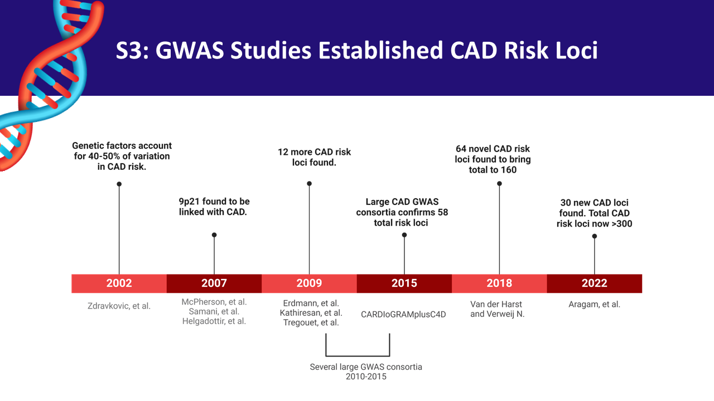

# Policy Brief: Prioritizing Cardiovascular Disease Research for Improved Public Health

## Issue summary

Coronary artery disease (CAD), the leading cause of death globally, results in over 300,000 annual fatalities in the U.S. alone. 

CAD is primarily driven by atherosclerosis—a chronic inflammatory disease characterized by arterial blockage developed from lipid accumulation, immune cell infiltration, and structural changes within arterial walls. Despite advancements in clinical treatments, including lipid-lowering drugs and anti-inflammatory therapies, CAD remains complex due to its multifactorial nature involving genetic, environmental, and lifestyle risk factors.

## Significance

Early detection and precise understanding of CAD are essential to prevent disease progression. CAD is the leading cause of cardiovascular deaths, significantly outpacing other conditions like stroke, hypertension, and heart failure. Additionally, it represents one of the top contributors to healthcare costs in the United States, reflecting its substantial economic burden.

Atherosclerosis develops silently through various stages, from early, reversible lesions to advanced, rupture-prone plaques causing heart attacks and ischemic strokes. Current diagnostic imaging techniques (such as IVUS, OCT, and CCTA) and histopathological exams are critical for monitoring CAD progression but have limitations in early detection and precise characterization.

## Historical context of genomic discoveries

Over the past two decades, genome-wide association studies (GWAS) have progressively identified hundreds of genetic risk loci linked to CAD. Beginning with the initial discoveries in 2002, researchers have steadily expanded general understanding of the genetic basis of CAD, now identifying over 300 risk loci. 
 
Despite this progress, these genomic studies have predominantly focused on populations of European ancestry, limiting their broader applicability.

## Opportunities in genomics and epigenetics

Advances in genomic research, particularly GWAS, have significantly enhanced our understanding of genetic predispositions influencing CAD onset and progression. Furthermore, innovations in chromatin accessibility sequencing assays (ATAC-seq) now allow researchers to examine the epigenetic landscape associated with CAD. These methods provide deeper insights into how genetic, environmental, and lifestyle factors interact, shaping individual risk profiles and guiding personalized interventions.

## Emerging technologies: computational and multi-omic epigenomics

Despite significant advances, much remains unknown about genomic regulators of CAD. Recent developments in epigenomics and computational biology offer promising new avenues for research. Multi-omics approaches, integrating bulk and single-cell ATAC-seq, RNA-seq, proteomics, and metabolomics, have revealed novel cardiovascular discoveries at patient, tissue, and cell-specific levels. Spatial transcriptomics presents further opportunities, enabling the study of cell-specific events across the atherosclerosis spectrum, including critical events such as plaque rupture. Additionally, novel computational tools, including machine learning and sequence embedding techniques, offer scalable, sophisticated methods to identify candidate genes and genetic loci associated with CAD, underscoring the feasibility and importance of further investment in these technologies.

## Policy recommendations:

1. Enhance funding for early detection research: Support initiatives focusing on early-stage atherosclerosis detection technologies to reduce morbidity and mortality associated with advanced CAD.
2. Increase diversity in genomic studies: Allocate resources toward multi-ethnic genomic research to ensure equitable benefits and applicability of genetic discoveries across diverse populations.
3. Expand epigenetic and multi-omic research: Invest in integrated multi-omic studies (combining genomic, epigenomic, transcriptomic, and proteomic data) to develop personalized diagnostic and therapeutic strategies.
4. Promote community-engaged policy development: Encourage partnerships between researchers, policymakers, and community representatives to ensure research findings translate into inclusive, accessible, and equitable healthcare solutions.

## Conclusion

By prioritizing cardiovascular research with a strong emphasis on early detection, genetic diversity, and comprehensive epigenetic profiling, policymakers can significantly reduce the public health and economic burdens of coronary artery disease.